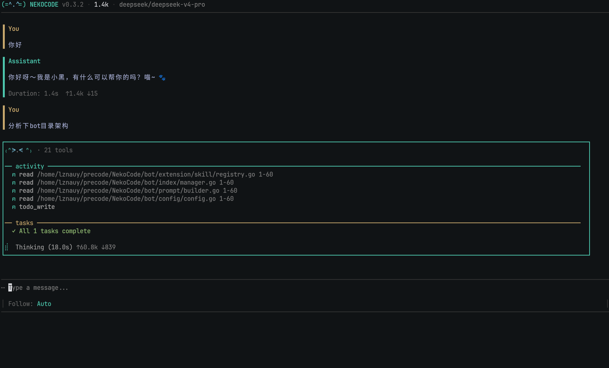
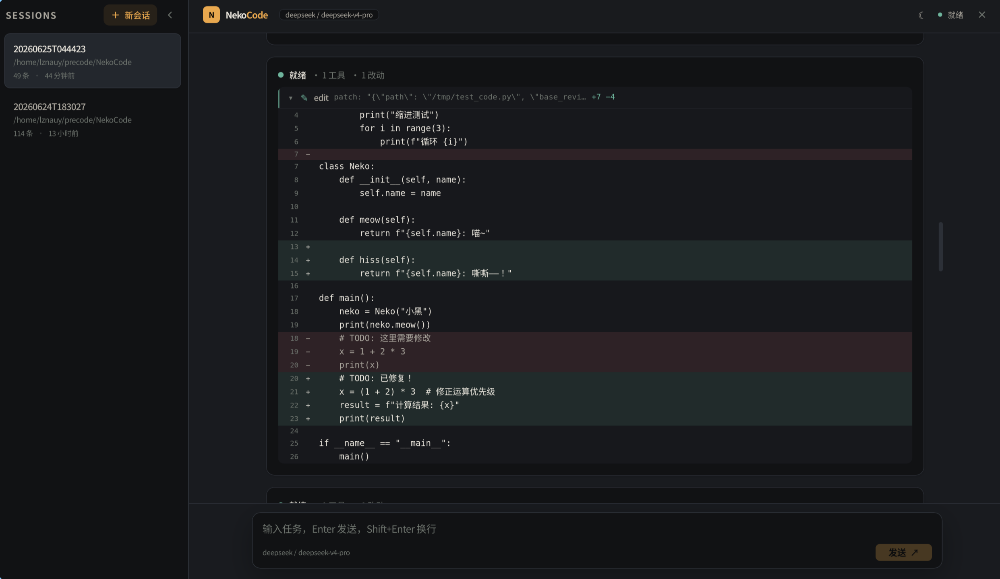

# NekoCode 🐱

<p align="center">
  <b>终端里的猫娘 AI 助手 &nbsp;·&nbsp; MIT 开源 &nbsp;·&nbsp; Go 单二进制</b>
</p>

<p align="center">
  <sub>多模型 · Agent 循环 · 子 Agent · TUI + GUI 双前端 · Plugin / MCP / Skill 生态</sub>
</p>

<p align="center">
  &nbsp;
  
</p>

---

## 这是什么

NekoCode 是一个运行在终端里的 AI 编程助手。你像聊天一样交代任务，它读代码、改文件、跑命令、搜资料，帮你把事情做完。

**不锁定供应商** — 同时支持 Anthropic 原生协议和 OpenAI 兼容协议（DeepSeek、MiniMax 等），一个 `/model` 就能切换。

**两套界面，一个核心** — TUI（终端）和 GUI（桌面窗口）共享同一套 Bot 引擎，换壳不改逻辑。

---

## 亮点

<table>
<tr>
<td width="50%">

### 🧠 Agent 循环
- Reason → Execute → Feedback 三轮循环
- 并行工具调度，自动判断依赖
- Mid-run BTW 中断：随时插入新指令
- 子 Agent 委派（executor / researcher / verify）

### 🛡️ 不搞坏你的代码
- 没读过的文件不准改，二进制文件不碰
- 删东西、`sudo`、`curl \| bash` 弹框确认或直接拒绝
- LLM 输出的垃圾自动过滤，不写进文件
- Agent 原地转圈自动停下，告诉你「可能卡住了」
- 改完 Go 文件自动跑 gofmt，语法有错立刻提示
- 对话长了压缩记忆时，你的核心要求不会被吞掉

### 🔧 工具系统
- 13 内置 + 条件/动态注册
- Bash 四级智能分级（安全命令自动放行）
- oldString/newString 内容锚定编辑 + gofmt 自动检查
- Web 搜索/抓取、图片生成、代码索引

</td>
<td width="50%">

### 📦 生态扩展
- **Plugin** — GitHub / 本地路径安装，Claude Code 插件兼容
- **MCP** — JSON-RPC 2.0，外部工具服务器接入
- **Skill** — YAML 定义技能包，`/<skill>` 一键加载

### 💾 会话记忆
- `/new` 新对话保留上一轮摘要，不消耗 API token
- 会话存档/恢复，`/sessions` 管理
- 支持 `~/.nekocode/memory.md` 手动维护项目记忆，自动注入上下文

### 🎨 双前端
- **TUI** — Bubble Tea + Lip Gloss，终端原生体验
- **GUI** — Wails v2 + React 18 + Tailwind CSS 4
- 共享 `bot.UI` / `bot.GUI` 契约，TUI/GUI 不直接依赖 bot 内部实现

### 🏗️ 工程基础
- 纯 Go SQLite（零 CGO），单二进制部署
- Tree-sitter 多语言代码索引 + FTS5 搜索
- 全局调试日志、文件缓存（LRU）、Token 预算管理

</td>
</tr>
</table>

---

## 快速开始

> **前提**：Go 1.25.8+。GUI 还需要 Node/npm、Wails CLI，Linux 上需要 GTK/WebKitGTK。

### 安装

```bash
# 方式一：go install（推荐）
go install github.com/lznauy/NekoCode/cmd@latest

# 方式二：源码编译
git clone https://github.com/lznauy/NekoCode.git
cd NekoCode
go build -o nekocode-tui ./cmd
./nekocode-tui
```

### 配置

最小配置只需要 `active`、`context_window`、`models` 三项。完整字段见 [ARCHITECTURE.md](docs/ARCHITECTURE.md)。

```bash
mkdir -p ~/.nekocode
cat > ~/.nekocode/config.json << 'EOF'
{
  "active": "deepseek",
  "context_window": 128000,
  "models": [
    {
      "name": "deepseek",
      "provider": "deepseek",
      "api_key": "sk-your-key-here",
      "model": "deepseek-chat",
      "base_url": "https://api.deepseek.com/v1",
      "protocol": "openai"
    }
  ]
}
EOF
```

<details>
<summary>完整配置示例（含图片生成等可选字段）</summary>

```json
{
  "active": "deepseek",
  "context_window": 128000,
  "flash_model": "deepseek",
  "models": [
    {
      "name": "deepseek",
      "provider": "deepseek",
      "api_key": "sk-...",
      "model": "deepseek-chat",
      "base_url": "https://api.deepseek.com/v1",
      "protocol": "openai"
    }
  ],
  "image_gen_models": [
    {
      "name": "jimeng",
      "provider": "jimeng",
      "api_key": "AKLT...",
      "secret_key": "...",
      "model": "jimeng_t2i_v31"
    }
  ]
}
```

| 核心字段 | 说明 | 必填 |
|---------|------|:--:|
| `active` | 当前激活的模型名 | ✓ |
| `context_window` | 上下文窗口（token） | ✓ |
| `models` | 模型列表（provider/api_key/model/base_url/protocol） | ✓ |
| `flash_model` | 子 Agent / 摘要用的轻量模型 | |
| `image_gen_models` | 文生图配置（即梦/火山引擎） | |

</details>

### 运行 GUI（可选）

```bash
cd gui && npm install && npm run build && cd ..
wails build
./build/bin/nekocode-gui

# 或开发模式
wails dev
```

---

## 内置命令

| 命令 | 说明 |
|------|------|
| `/help` | 显示所有命令 |
| `/model [name]` | 列出或切换模型 |
| `/plan <任务>` | 只读探索 → 方案审批 → 执行 |
| `/new` · `/clear` | 新对话 / 清空历史 |
| `/stats` · `/context` | 上下文用量 / 详细分解 |
| `/summarize` | 手动压缩上下文 |
| `/config` | 当前 provider 和 model |
| `/plugin` | 插件安装/卸载/列表 |
| `/sessions` | 会话存档/恢复 |
| `/export` | 导出对话到 JSON |
| `/<skill>` | 加载技能（动态注册） |

输入 `/` 弹出补全菜单，`Tab` / `Shift+Tab` 选择。

---

## 安全分级

| 等级 | 行为 | 示例 |
|:--|:--|:--|
| `safe` | 自动放行 | `read` `grep` `git log` `go vet` |
| `modify` | 弹框确认 | `write` `edit` `mkdir` `git commit` |
| `danger` | ⚠ 警告确认 | `rm` `kill` `git push -f` `curl` |
| `blocked` | 🚫 直接拒绝 | `sudo` `ssh` `dd` `| bash` |

纯输出命令（`git diff`、`go version` 等）自动识别为 safe，无需确认。

> **Bash 动态分级**：`bash` 命令按内容自动判定——`ls`/`cat` 归 safe，`mkdir`/`git commit` 归 modify，`rm`/`curl` 归 danger，`sudo`/`ssh` 归 blocked。无法识别的命令默认归 modify。

---

## 文档

| 文档 | 内容 |
|------|------|
| [ARCHITECTURE.md](docs/ARCHITECTURE.md) | 完整目录结构、Agent 循环、工具系统、Hook/Plugin/MCP 实现细节 |
| [DESIGN.md](docs/DESIGN.md) | 交互设计、TUI 视觉规范、上下文策略、防幻觉设计原则 |
| [PLAN.md](docs/PLAN.md) | 开发路线图：已完成功能 & 计划中 |
| [FEATURE_GAP.md](docs/FEATURE_GAP.md) | 与 Claude Code 的功能对比分析 |

---

## License

MIT License
