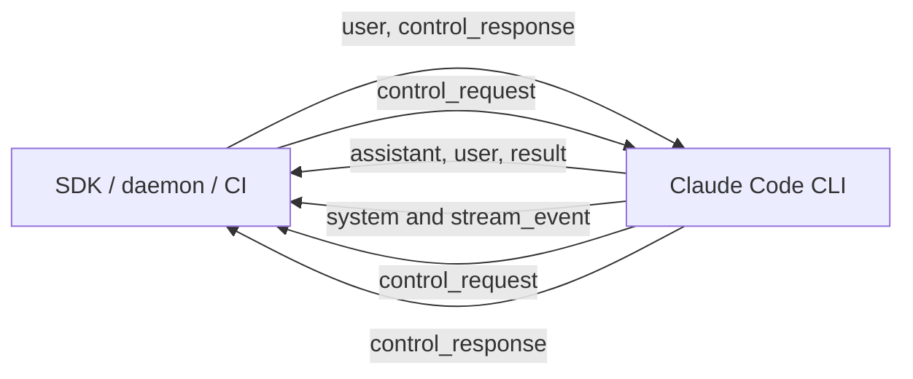
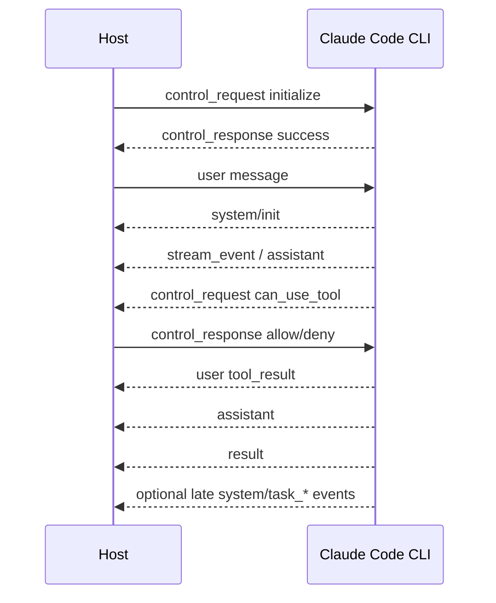

# Claude Code stream-json CLI 协议调研

> 调研日期：2026-09-12
> 版本快照：`@anthropic-ai/claude-agent-sdk` 0.3.269，对应 Claude Code 2.1.269
> 状态：技术调研，不是 NekoCode 已承诺支持的协议规范

## 1. 结论

Claude Code `stream-json` 是 Claude Code CLI 与宿主程序之间的双向、长连接、
NDJSON 协议。它最初服务于 `claude -p` 的机器可读输出，随后扩展为 Agent SDK
驱动 CLI 子进程时使用的控制平面。它同时承载：

- 用户消息和模型消息；
- Anthropic Messages API 的完整消息块与可选原始流事件；
- turn 结果、费用和 usage；
- 工具权限、Hooks、SDK 内嵌 MCP 等反向调用；
- 会话控制，如初始化、中断、切换模型和权限模式；
- 后台任务、sub-agent 和 Dynamic Workflow 的生命周期事件。

它采用自己的 `type` / `subtype` 消息格式，没有使用 JSON-RPC 2.0，也没有像 ACP
那样用独立 schema 和协议版本约束互操作。公开 CLI 文档只描述了主要参数和输出
用法，更完整的公开线协议契约位于 Agent SDK 发布包的 TypeScript 声明。兼容实现
应固定 Claude Code/Agent SDK 版本、忽略未知字段，并通过 capability 检测可选行为。

NekoCode 可以新增 stream-json adapter，并复用现有 runtime 的运行、事件、审批、
问题和取消能力。基础 headless 对话兼容可行；完整模拟 Claude Code 2.1.269 的全部
控制请求没有必要，也不现实。建议定义一个明确的兼容子集，再为 Dynamic Workflow
单独扩展 runtime 事件。

## 2. 资料与可信度

本调研按以下证据优先级整理：

1. Anthropic 官方 Agent SDK npm 包 `sdk.d.ts`：公开的、机器可读的当前类型契约；
2. Anthropic 官方 CLI 和 Agent SDK 文档：稳定功能与启动参数；
3. CodeBuddy 官方 Workflow stdio 文档：声明与 Claude Code 2.1.220 对齐的 Workflow
   子集；
4. Anthropic 官方仓库 issue/release：用于确认文档缺口、版本变化和边界行为，不作为
   稳定规范。

主要来源：

- [Claude Code CLI reference](https://code.claude.com/docs/en/cli-reference)
- [Claude Code headless/programmatic usage](https://code.claude.com/docs/en/headless)
- [Claude Agent SDK TypeScript](https://code.claude.com/docs/en/agent-sdk/typescript)
- [Anthropic Claude Agent SDK TypeScript repository](https://github.com/anthropics/claude-agent-sdk-typescript)
- [Agent SDK npm package](https://www.npmjs.com/package/@anthropic-ai/claude-agent-sdk)
- [CodeBuddy Workflow stdio 协议](https://www.codebuddy.cn/docs/cli/workflow-stdio-protocol)

官方 CLI 文档确认了 `--input-format stream-json`、
`--output-format stream-json`、`--include-partial-messages` 等入口，但没有完整列出
input/control schema。因此，本文把具体字段标为“SDK 类型契约”，不把它们描述成
独立标准。

## 3. 启动模式

典型单次 prompt：

```bash
claude -p "explain this project" --output-format stream-json --verbose
```

双向 streaming input：

```bash
claude -p \
  --input-format stream-json \
  --output-format stream-json \
  --verbose
```

逐 token 原始事件：

```bash
claude -p \
  --input-format stream-json \
  --output-format stream-json \
  --verbose \
  --include-partial-messages
```

三种使用方式的生命周期不同：

| 方式 | stdin | turn 数量 | 进程生命周期 |
| --- | --- | --- | --- |
| `-p "prompt"` | prompt 来自参数 | 单 turn | result 后退出 |
| text input | 原始文本 | 通常单 turn | EOF/result 后退出 |
| stream-json input | NDJSON 消息和控制请求 | 可多 turn | stdin 保持打开时可持续运行 |

stream-json input 不只是输入编码选项。它让 stdin 成为长期存在的双向控制通道；关闭
stdin 可能同时切断权限、Hook 和 SDK MCP 回调，所以不能把 EOF 当作普通的取消命令。

## 4. 传输与分层

### 4.1 传输约束

- CLI 是宿主启动的子进程；
- stdin/stdout 使用 UTF-8；
- 每行一个完整 JSON 对象，以 `\n` 分隔；
- stdout 是协议流，日志应进入 stderr；
- 消息是带 `type` 判别器的对象，没有 `jsonrpc: "2.0"`；
- 部分请求通过 `request_id` 关联，普通 user/assistant/result 不采用统一 RPC id。

### 4.2 四个逻辑平面



协议可以按职责理解为四层：

| 平面 | 典型消息 | 用途 |
| --- | --- | --- |
| 对话数据 | `user`、`assistant` | 模型输入、输出和工具块 |
| 观测事件 | `system/*`、`stream_event` | 初始化、状态、任务、重试、增量流 |
| turn 结算 | `result` | turn 的权威完成、费用、usage、错误 |
| 双向控制 | `control_request/response/cancel_request` | 初始化、权限、Hooks、MCP、中断和配置 |

这种设计把数据流、事件流和 RPC 控制流复用在同一条 NDJSON 管道上。实现简单，便于
CLI/SDK 演进，但接收方必须同时维护消息 reducer、request registry 和会话状态机。

## 5. 核心消息

### 5.1 `user`

宿主通过 stdin 发送用户消息：

```json
{
  "type": "user",
  "message": {
    "role": "user",
    "content": "explain this project"
  },
  "parent_tool_use_id": null,
  "uuid": "client-generated-uuid"
}
```

`message` 使用 Anthropic Messages API 的 `MessageParam`，因此 content 可以是字符串，
也可以是 text、image、document、tool_result 等块。SDK 类型还允许：

- `uuid`：由客户端生成，用于把回复和 result 关联到发送；
- `priority: now | next | later`：队列优先级；
- `shouldQuery: false`：只追加 transcript，不立即触发模型 turn；
- `parent_tool_use_id`：消息属于哪个 sub-agent/tool 调用；
- `session_id`：输出和回放消息中的会话标识。

会话恢复主要通过进程启动参数 `--resume` / `--continue` 完成。不能假定首条 user
消息里的 `session_id` 会把一个未绑定进程切换到该历史会话。

### 5.2 `system/init`

CLI 通常在每个 turn 开始处发出会话元数据：

```json
{
  "type": "system",
  "subtype": "init",
  "session_id": "...",
  "uuid": "...",
  "claude_code_version": "2.1.269",
  "cwd": "/workspace",
  "model": "...",
  "tools": ["Read", "Edit", "Bash"],
  "mcp_servers": [],
  "permissionMode": "default",
  "slash_commands": [],
  "skills": [],
  "plugins": [],
  "capabilities": []
}
```

`capabilities` 是开放集合。消费者应检测所需 capability，而不是只比较 CLI 版本。
当前类型注释中包括 interrupt receipt、取消 queued commands 和 queued notification 等
能力。

### 5.3 `assistant`

```json
{
  "type": "assistant",
  "message": {
    "id": "msg_...",
    "role": "assistant",
    "model": "...",
    "content": [{"type": "text", "text": "..."}],
    "stop_reason": null,
    "usage": {}
  },
  "parent_tool_use_id": null,
  "uuid": "...",
  "session_id": "..."
}
```

内部 `message` 基本沿用 Anthropic Messages API 的 `Message`，content 可包含 text、
thinking、tool_use 等块。一个 API response 在输出侧可能拆成多条 `assistant`，共享同一
`message.id`，每条只带一个已完成 content block。因此消费者不能把每条 assistant 都
当成独立模型回复。

`parent_tool_use_id != null` 表示内容来自由该 tool use 启动的 sub-agent。

### 5.4 `stream_event`

只有启用 `--include-partial-messages` 时才输出：

```json
{
  "type": "stream_event",
  "event": {
    "type": "content_block_delta",
    "delta": {"type": "text_delta", "text": "partial"}
  },
  "parent_tool_use_id": null,
  "uuid": "...",
  "session_id": "..."
}
```

`event` 直接承载 Anthropic Messages API 的原始 streaming event。它用于低延迟预览；
完整 `assistant` 和最终 `result` 仍会到达。客户端应避免同时渲染 delta 和完整块造成
重复文本。

### 5.5 `result`

每个 turn 恰好一条 result。成功示例：

```json
{
  "type": "result",
  "subtype": "success",
  "is_error": false,
  "result": "final assistant text",
  "duration_ms": 1234,
  "duration_api_ms": 900,
  "num_turns": 2,
  "stop_reason": "end_turn",
  "total_cost_usd": 0.01,
  "usage": {},
  "modelUsage": {},
  "permission_denials": [],
  "uuid": "...",
  "session_id": "..."
}
```

错误 subtype 包括：

- `error_during_execution`；
- `error_max_turns`；
- `error_max_budget_usd`；
- `error_max_structured_output_retries`。

`result` 是 turn-complete 信号，不一定是整个会话或所有后台任务的完成信号。SDK 类型
明确允许 task notification、session state 或 prompt suggestion 在 result 后继续出现。
持久进程中每个输入 turn 都会产生自己的 result。

费用和 `modelUsage` 在 streaming-input 会话中是 query 生命周期内的累计值，读取最新
result 即可，不能把每个 result 再求和。

## 6. 双向控制协议

### 6.1 Envelope

request：

```json
{
  "type": "control_request",
  "request_id": "r-1",
  "request": {"subtype": "..."}
}
```

成功 response：

```json
{
  "type": "control_response",
  "response": {
    "subtype": "success",
    "request_id": "r-1",
    "response": {}
  }
}
```

失败 response：

```json
{
  "type": "control_response",
  "response": {
    "subtype": "error",
    "request_id": "r-1",
    "error": "human-readable error"
  }
}
```

request 可以由任一侧发起。发起方选择 `request_id`，在所有未完成请求中保持唯一；
接收方通常返回一条对应 response。它具备 RPC 语义，但没有 JSON-RPC 的 method、params、
标准错误码和统一版本协商。

`control_cancel_request` 表示发起方不再等待自己先前请求的答案：

```json
{"type":"control_cancel_request","request_id":"r-1"}
```

双方还可能发送 `{"type":"keep_alive"}`；接收方应忽略其内容并仅用于保活。

### 6.2 initialize

Agent SDK 通常先发：

```json
{
  "type": "control_request",
  "request_id": "init-1",
  "request": {
    "subtype": "initialize",
    "hooks": {},
    "sdkMcpServers": [],
    "agents": {},
    "promptSuggestions": false
  }
}
```

它用于注入宿主侧能力与配置，包括 Hooks、SDK-hosted MCP servers、system prompt、
agents、skills、JSON Schema、对话框能力和 per-task stop affordance。成功响应返回 commands、
agents、models、output styles 和账户信息等。

这与 ACP initialize 的“对称能力协商”不同。stream-json initialize 更像宿主对一个已知
Claude Code 进程做配置和发现；部分新行为通过 `system/init.capabilities` 单向声明。

初始化响应可能包含账户 token、企业和邮箱信息。原始 stdout 不应直接进入普通日志、
错误报告或公开 artifact。

### 6.3 interrupt

```json
{
  "type": "control_request",
  "request_id": "stop-1",
  "request": {
    "subtype": "interrupt",
    "cancel_queued": true
  }
}
```

interrupt 中止当前 conversation turn。具备对应 capability 的版本会在 ACK 中返回仍在
队列中的 message UUID，`cancel_queued: true` 还能同步取消队列项。ACK 表示中断请求已
处理，不代替被中断 turn 的 result 或后台任务终态。

在 Workflow 场景，宿主还应等待 `task_notification.status = stopped`。声明
`perTaskStopAffordance` 后，可以使用 `stop_task` 单独停止后台任务；没有该能力时，系统
倾向于让 interrupt 同时清理无法由 UI 单独停止的后台工作。

### 6.4 权限和反向请求

CLI 可以向宿主发送 `control_request`：

```json
{
  "type": "control_request",
  "request_id": "permission-1",
  "request": {
    "subtype": "can_use_tool",
    "tool_name": "Bash",
    "input": {"command": "go test ./..."},
    "tool_use_id": "toolu_..."
  }
}
```

SDK 类型还定义了 Hook callback、MCP message、elicitation、user dialog 等反向请求。
这意味着一个兼容 host 不能只读 stdout；必须在 agent 运行中继续写 stdin，并允许响应
与模型/工具事件交错。

## 7. 后台任务与 Workflow

后台 task 使用同一组 system subtype：

- `task_started`：注册任务；
- `task_progress`：进度和 usage；
- `task_updated`：状态 patch；
- `task_notification`：`completed | failed | stopped` 权威终态；
- `background_tasks_changed`：当前活动后台任务集合的 level signal。

基础 task 状态包含：

```text
pending → running → completed | failed | killed
                   ↕
                 paused
```

Dynamic Workflow 通过 `task_type: "local_workflow"` 区分，并增加
`workflow_name`。CodeBuddy 记录的 Claude Code 2.1.220 Workflow 形态还在
`task_progress.workflow_progress` 中携带：

- `workflow_phase { index, title }`；
- `workflow_agent { index, agentId, state, startedAt, endedAt, ... }`。

其中 `task_progress.workflow_progress` 是快照替换语义，`task_updated.patch` 是增量合并
语义，`task_notification` 是终态边沿。这三种 reducer 规则不同，消费者不能统一按 append
处理。

CodeBuddy 文档指出中断后可能有晚于 task notification 的 sub-agent progress。兼容 UI
可以把 task notification 立即用于终态展示，同时短暂保留 task reducer 以吸收迟到事件。

## 8. 时序与关联模型

### 8.1 多种 ID 各司其职

| 字段 | 作用 |
| --- | --- |
| `session_id` | 会话归属 |
| message `uuid` | wire 消息身份 |
| user `uuid` / `user_message_uuid` | 输入与回复/result 的关联 |
| Anthropic `message.id` | 同一个模型 API message，可能跨多个 assistant frame |
| `request_id` | control request/response 关联 |
| `tool_use_id` | tool use、权限和后台 task 的关联 |
| `task_id` | 后台任务 reducer key |
| `parent_tool_use_id` | sub-agent 输出的父调用 |

不能用单一 ID 替代全部关系。例如连续 assistant frame 可能有相同 `message.id`，但各自有
不同 wire `uuid`；权限响应依靠 `request_id`，工具展示依靠 `tool_use_id`。

### 8.2 一个典型 turn



### 8.3 权威数据与预览数据

协议经常同时提供低延迟信号和权威结算：

| 需求 | 预览/边沿 | 权威数据 |
| --- | --- | --- |
| 模型文本 | `stream_event` delta | 完整 assistant/result |
| turn 完成 | assistant stop 信息 | `result` |
| 权限拒绝 | `system/permission_denied` | `result.permission_denials` |
| workflow 进度 | 单次 task progress | 最新 workflow progress 快照 |
| workflow 完成 | task updated patch | `task_notification` |

实现 reducer 时要为每类数据明确权威来源，不能仅凭最后看到的事件类型推导。

## 9. 演进与兼容策略

Claude Code stream-json 使用产品版本演进，没有独立的 wire protocol version。当前公开
类型已经包含大量为旧客户端保留的可选字段和开放集合。兼容客户端应遵循：

1. 固定已验证的 Claude Code/Agent SDK 版本范围；
2. 忽略未知顶层 `type`、system `subtype`、字段和 capability；
3. 所有新增字段按 optional 处理；
4. 只在 capability 明确存在时使用对应控制行为；
5. 对未知 control request 返回结构化 error，不能挂起；
6. stdout 严格按 NDJSON 解析，处理任意 chunk 边界和半行；
7. 对重复、迟到和重放事件使用 ID 去重；
8. 不记录 initialize 中的 token，也不信任任务 label、preview 等展示文本；
9. 对输入行设置合理但足够大的上限，并以结构化错误结束而不是静默截断；
10. 使用 fixture 和真实 CLI 双重兼容测试，不只依赖手写类型。

官方仓库曾记录 stream-json 输入 schema 文档不完整、非法 `set_model` 导致会话挂起、
长输入行解析和 stdin 生命周期等问题。接入方需要把它视为版本化产品协议，不能假定
线协议会长期保持不变。

## 10. 与 ACP 的架构差异

| 维度 | Claude Code stream-json | ACP v1 |
| --- | --- | --- |
| 定位 | Claude Code CLI/Agent SDK 的产品协议 | 编辑器与任意 coding agent 的开放协议 |
| Envelope | `type/subtype` discriminated union | JSON-RPC 2.0 |
| 版本 | 跟随 CLI/SDK 产品版本 | initialize 协商 protocolVersion |
| 能力 | init metadata + 开放 capability 字符串 | 双方结构化 capabilities |
| 对话 | user/assistant/result 事件 | session/prompt + session/update |
| 控制 | 同流 control request/response | 双向 JSON-RPC 方法 |
| 模型内容 | 直接复用 Anthropic Message 类型 | 协议自有 ContentBlock |
| Workflow | task 系统原生表达 | v1 没有 workflow 标准对象 |
| 兼容目标 | Claude Code SDK/daemon/CI | IDE/编辑器/agent 跨厂商互操作 |

两者可以共享同一个 NekoCode runtime，但不应共享 wire codec。正确结构是两个独立
adapter：

```text
                      ┌─ ACP adapter ───────── ACP clients
NekoCode runtime ─────┤
                      └─ stream-json adapter ─ Claude-compatible hosts
```

## 11. NekoCode 接入评估

### 11.1 可直接复用

NekoCode runtime 已有：

- `StartRun`、`WaitRun`、`CancelRun`；
- assistant/reasoning delta；
- tool start/preview/complete/blocked；
- sub-agent start/end；
- todos/plan；
- approval 与 question broker；
- run done/failed/cancelled；
- session 和 usage 查询。

这些能力足以实现基础 stream-json host contract。现有 ACP 包也证明了 runtime 事件可以
投影为另一种 wire schema，但新实现应放在独立包，不能向 ACP codec 添加 stream-json
分支。

### 11.2 第一阶段兼容子集

建议第一阶段只承诺：

**stdin**

- `user` text/content blocks 中的 text；
- `control_request.initialize`；
- `control_request.interrupt`；
- `control_response`，用于回答 NekoCode 发出的权限/问题请求；
- `keep_alive`。

**stdout**

- `system/init`；
- `assistant` text/thinking/tool_use；
- `user` tool_result；
- 可选 `stream_event` text/thinking delta；
- `result success/error_during_execution`；
- `control_request.can_use_tool`；
- `control_response`；
- 基础 `task_started/task_updated/task_notification`。

启动入口建议兼容常见参数：

```bash
nekocode-tui -p \
  --input-format stream-json \
  --output-format stream-json \
  --verbose
```

内部也可以提供更明确的 `--stream-json`，但只有兼容 Claude SDK 启动器时才需要接受完整
Claude CLI 参数外形。

### 11.3 需要新增的组件

建议目录：

```text
streamjson/
├── types.go       # 已承诺兼容的 input/output union
├── codec.go       # NDJSON reader/writer、大小限制、stdout 串行化
├── server.go      # session、turn 和 control request registry
├── messages.go    # Anthropic content block 投影
├── events.go      # runtime Event → stream-json
├── control.go     # initialize、interrupt、权限、问题
├── tasks.go       # task reducer 与终态
└── stdio.go       # standard runtime 装配
```

`cmd/tui/main.go` 只负责解析模式并选择 `acp.RunStdio` 或 `streamjson.RunStdio`。

### 11.4 完整 Workflow 的缺口

NekoCode 当前 sub-agent 事件缺少：

- workflow/task 的名称、描述和独立 ID；
- phase index/title；
- paused、cached、killed、error 等细状态；
- startedAt/endedAt、token、result preview；
- workflow progress 权威快照；
- output file 和 workflow usage；
- 终态后的 drain/grace-window 语义。

因此第一阶段可以把 sub-agent 表达为普通 `local_agent` task。只有 runtime 增加正式的
Workflow 模型后，才应输出 `task_type: local_workflow`，否则会向消费者承诺并不存在的
状态和时序保证。

### 11.5 主要风险

| 风险 | 影响 | 缓解方式 |
| --- | --- | --- |
| wire schema 随 Claude CLI 高频变化 | 新客户端可能发送未知请求 | 固定兼容版本、宽容解码 |
| 输出块与 delta 重复 | UI 重复文本 | reducer 区分 preview 与 canonical |
| stdout 并发写导致行交错 | 整条连接损坏 | 单 writer goroutine |
| result 后仍有后台事件 | 过早关闭进程/管道 | 分离 turn 和 session/task 终态 |
| permission request 与事件交错 | agent 死锁 | 独立 request registry 和写循环 |
| stdin EOF 过早 | MCP/Hook/权限回调失败 | 显式 interrupt/shutdown 生命周期 |
| init 泄露账户 token | 凭据进入日志 | 字段级 redaction，默认不录 raw frame |
| 伪造 local_workflow 语义 | 客户端 reducer 错乱 | 有完整状态模型后再声明 |

## 12. 建议的验证矩阵

实现前先保存 Claude Code 2.1.269 的最小 golden traces：

1. 单次文本 prompt；
2. streaming input 两个连续 turn；
3. `--include-partial-messages`；
4. text + tool use + tool result；
5. can-use-tool allow、deny、cancel；
6. interrupt 正常 turn；
7. sub-agent 前台和后台执行；
8. Dynamic Workflow 完成、失败和中断；
9. result 后迟到 task notification；
10. 未知字段、未知 subtype、重复 frame 和超大输入行。

测试分三层：codec 单测、runtime 映射测试、真实 Claude Agent SDK 驱动 NekoCode 的端到端
测试。端到端测试应断言行为和 reducer 终态，不对整行 JSON 做脆弱的全字段快照。

## 13. 推荐决策

NekoCode 适合支持一个范围明确的 Claude stream-json 兼容档案：

- ACP 继续作为稳定、跨厂商的首选 agent-client 协议；
- stream-json 用于接入已经围绕 Claude Agent SDK 构建的 daemon、CI 和 Workflow UI；
- 第一阶段覆盖对话、工具、审批、取消和 result；
- sub-agent 先投影为 `local_agent`；
- 等 NekoCode 有正式 Workflow runtime 后再承诺 `local_workflow`；
- 每个 release 明确记录验证过的 Claude Code/Agent SDK 版本。
